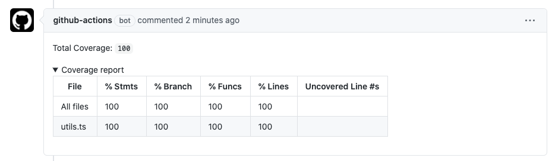

<div align="center">
    <h1>jest-coverage-comment-action</h1>
</div>

<p>Comments a PR with the coverage (jest)</p>



---

## Table of Contents

<!-- START doctoc generated TOC please keep comment here to allow auto update -->
<!-- DON'T EDIT THIS SECTION, INSTEAD RE-RUN doctoc TO UPDATE -->

- [Inputs](#inputs)
  - [`github-token`](#github-token)
  - [`jest-command`](#jest-command)
  - [`only-changes`](#only-changes)
  - [`working-directory`](#working-directory)
  - [`delete-previous`](#delete-previous)
- [Example of usage](#example-of-usage)
- [Example using a custom jest command](#example-using-a-custom-jest-command)
- [Development](#development)
  - [Close release](#close-release)
  - [Documentation](#documentation)

<!-- END doctoc generated TOC please keep comment here to allow auto update -->

## Inputs

### `github-token`

**Required** The github token to comment in the PR.

### `jest-command`

**Optional** The command used to generate the coverage. Default: `npx jest --coverage`

### `only-changes`

**Optional** Add parameter to show the coverage only for the changed files. Default: `true`

### `working-directory`

**Optional** The command used to generate the coverage. Default: `''`

### `delete-previous`

**Optional** Delete previous comments before adding a new one. Default: `true`

## Example of usage

```yaml
uses: raulanatol/jest-coverage-comment-action@v1.0.0
with:
  github-token: ${{ secrets.GITHUB_TOKEN }}'
```

## Example using a custom jest command and working directory

**.github/workflows/main.yml**

```yaml
on: pull_request

jobs:
  build:
    runs-on: ubuntu-latest
    steps:
      - name: Hello world action step
        id: hello
        uses: raulanatol/jest-coverage-comment-action@v1.0.0
        with:
          github-token: ${{ secrets.GITHUB_TOKEN }}
          jest-command: 'npm run jest-ci'
          working-directory: 'packages/my-package'
```

## Development

### Close release

To close a release you only need to execute the makefile with `release_{major|minor|patch}`

Example:

```shell script
make release_minor
```

### Documentation

To generate the documentation you only need to execute the makefile with `docs`.

> Using [doctoc](https://github.com/thlorenz/doctoc)

```shell script
make docs
```
